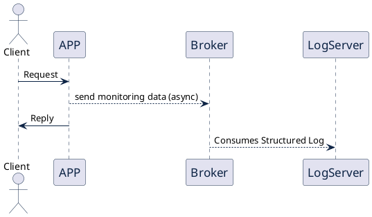

# About

::: columns

:::: {.column width=70%}

* Brazilian/Italian living in France { width=5% } { width=5% } { width=5% }
* Currently, Golang SE @[Beat](https://thebeat.co/en/)
* Previously, C++ SE @[Amadeus](https://amadeus.com/it)
* Still before, Java SE @[Unicredit](https://www.unicredit.it/it/privati.html)

::::

:::: {.column width=30%}

::::
:::

# Problem statement

## Instrumenting an application with functional monitoring

1. Functional Monitoring using semi-structured log (JSON) 
1. Ease of use across all the application call stack
1. Granularity of monitoring is 1 JSON per transaction
1. Logging should happen also when flow exceptions occur
  
# Functional Monitoring using semi-structured log (JSON)
### Common data:
  ```json
  {
    "traceID": "A2C4e",
    "httpMethod": "POST",
    "URI": "v1/my-awsome-uri/param/resource",
    "httpHeaders": [ 
      {
        "key": "Content-Type",
        "value": "application/json"
      }
    ],
    "httpStatus": 200
  }
  ```

# Functional Monitoring using semi-structured log (JSON)
### Business data:
  ```json
  {
    "business": {
      "user": "doctorUser",
      "affinity": 2.5,
      "healthPerf": {
        "cardio": 0.6,
        "power": 0.7,
        "elasticity": 0.3
      }
    }
  }
  ```

# Ease of use across all the application call stack
### Callback look

```
callback
|-- method1
|   |-- method11
|   |-- method12
|-- method2
|-- method3
    |-- method31
    |   |-- method311
    |-- method32
    |-- method33
```
### Our JSON need to be enriched across all methods

# Granularity of monitoring is 1 JSON per transaction
::: columns

:::: column

* Not overloading the server with logs
* Scales with the application transaction rate
* Functionally makes sense to have transaction-view  

::::

:::: column



::::

:::

# Ingredient number 1: the std::weak_ptr


::: columns

:::: {.column width=40%}
* can't be dereferenced
* can't be tested for nullness
* track _dangling_ pointers without interfering with their reference count  
::::

:::: {.column width=60%}
```cpp
// if wPtr is expired, sPtr is nullptr
std::shared_ptr<Data> sPtr = wPtr.lock(); 
```
::::

:::

### 
> 'is a smart pointer that holds a non-owning reference to an object that is managed by std::shared_ptr'
>
> -- <cite>[cppreference](https://en.cppreference.com/w/cpp/memory/weak_ptr)</cite>


# Ingredient number 2: RAII

## RAII Alias: Scope-based Resource Management
* Resource will be released at destruction time
* Object destruction happens regardless of exceptions or unpredicted flow control

## Example with std::shared_ptr
```{.cpp .numberLines}
{ // scope begins
    auto customDestructor = [](item* logPtr) {
                // logic with item at it's destruction time
                delete logPtr;
            }
    std::shared_ptr<item> aLog(new item, customDestructor);
    // logic...
    
} // scope ends -> destructor will be called (even if exception is thrown)
```

# The pattern 

\small
```{.cpp .numberLines .lineAnchors startFrom="1"}
std::shared_ptr<json> StructuredLog() {
    // static reference to a non-owning json
    static std::weak_ptr<json> _logNonOwningRef;
    auto aLog = _logNonOwningRef.lock();
    // If resource is not initialized, do init it and keep it in the local instance
    if (not aLog) {
        aLog = std::shared_ptr<json>(new json, [](json* logPtr) {
            if (logPtr) {
                // network call to send event to log server
                remoteSend(*logPtr);
            }
            delete logPtr;
        });
        _logNonOwningRef = aLog;
    }
    return aLog;
}
``` 
\normalsize

# Usage

```cpp
void method1() {
    StructuredLog()["field1"] = "value1";
}
void method2() {
    StructuredLog()["field2"] = "value2";
}
```

::: columns
:::: {.column width=50%}
```cpp
{ // callback scope
    auto ss = StructuredLog(); 
    method1(); 
    method2();
} // end scope - remoteSend 
```
:::: 
:::: {.column width=50%}
### Sent Log
```json
{
  "field1": "value1",
  "field2": "value2"
} 
```
::::
:::

# Benefits and Drawbacks

::: columns
:::: {.column width=50%}
## Benefits
1. Convenience of use
2. Tunable efficiency through use of scopes
3. Concise implementation
4. Reliability derived from RAII
5. **Testability of your logging**
::::

:::: {.column width=40%}
## Drawbacks
1. Watch-out for static members and for global scopes
2. Careful with concurrency
3. No exceptions on Destructor
::::
:::

# Demo Dummy Framework

::: columns

:::: {.column width=50%}
```cpp
struct HTTPRequest {
    HTTPMethod method;
    HTTPParameters parameters;
    HTTPHeaders headers;
    std::string uri;
    std::string body;
};
```
::::

:::: {.column width=50%}
```cpp
struct HTTPResponse {
    HTTPHeaders headers;
    HTTPStatus status;
    std::string body;
};
```
::::

:::

```cpp


using HTTPHandler 
    = std::function<void(HTTPResponse& resp, const HTTPRequest& req)>;

using HTTPHandlerFunc = std::function<HTTPHandler(HTTPHandler)>;
```

# Demo

::: columns
:::: {.column width=80%}
{ width=60% }
::::
:::

# Acknowledgements

1. [Sandor Dargo](https://www.sandordargo.com/)
1. [Anthony Buisse](https://www.linkedin.com/in/anthony-buisset/)
1. [jsoncons library](https://github.com/danielaparker/jsoncons) 
1. [Beat](https://thebeat.co/)
1. [JetBrains](https://www.jetbrains.com/)

# Links contacts 

* [{ width=5% } rbroggi](https://github.com/rbroggi)
* [{ width=4% } rbroggi](https://www.linkedin.com/in/rbroggi/)
