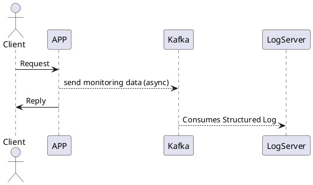

# About

::: columns

:::: {.column width=70%}

* Brazilian/Italian living in France { width=5% } { width=5% } { width=5% }
* Currently, Golang SE @[Beat](https://thebeat.co/en/)
* Previously, C++ SE @[Amadeus](https://amadeus.com/it)
* Still before, Java SE @[Unicredit](https://www.unicredit.it/it/privati.html)

::::

:::: {.column width=30%}

::::
:::

# Problem statement

## Instrumenting an application with functional monitoring

1. Monitoring done using structured (JSON) log 
1. Ease of use across all the application call stack
1. Granularity of monitoring is 1 JSON per transaction
1. Logging should happen also when flow exceptions occur
  
# Monitoring done using structured (JSON) log
### Common data:
  ```json
  {
    "traceID": "A2C4e",
    "httpMethod": "POST",
    "URI": "v1/my-awsome-uri/param/resource",
    "httpHeaders": [ 
      {
        "key": "Content-Type",
        "value": "application/json"
      }
    ],
    "httpStatus": 200
  }
  ```

# Monitoring done using structured (JSON) log
### Business data:
  ```json
  {
    "business": {
      "user": "doctorUser",
      "affinity": 2.5,
      "healthPerf": {
        "cardio": 0.6,
        "power": 0.7,
        "elasticity": 0.3
      }
    }
  }
  ```

# Ease of use across all the application call stack
### Callback look

```
callback/
|-- method1
|   |-- method11
|   |-- method12
|-- method2
|-- method3
    |-- method31
    |   |-- method311
    |-- method32
    |-- method33
```
### Our JSON need to be enriched across all methods

# Granularity of monitoring is 1 JSON per transaction



# Granularity of monitoring is 1 JSON per transaction
::: columns

:::: column

* Not overloading the server with logs
* Transaction is a good granularity to adapt
to have a scalable service

::::

:::: column


::::

:::

# Acknowledgements

1. [Sandor Dargo](https://www.sandordargo.com/)
1. [Anthony Buisse](https://www.linkedin.com/in/anthony-buisset/)
1. [jsoncons library](https://github.com/danielaparker/jsoncons) 
1. [Beat](https://thebeat.co/)
1. [JetBrains](https://www.jetbrains.com/)

# Links contacts 

* [ Rodrigo Broggi](https://github.com/rbroggi)
